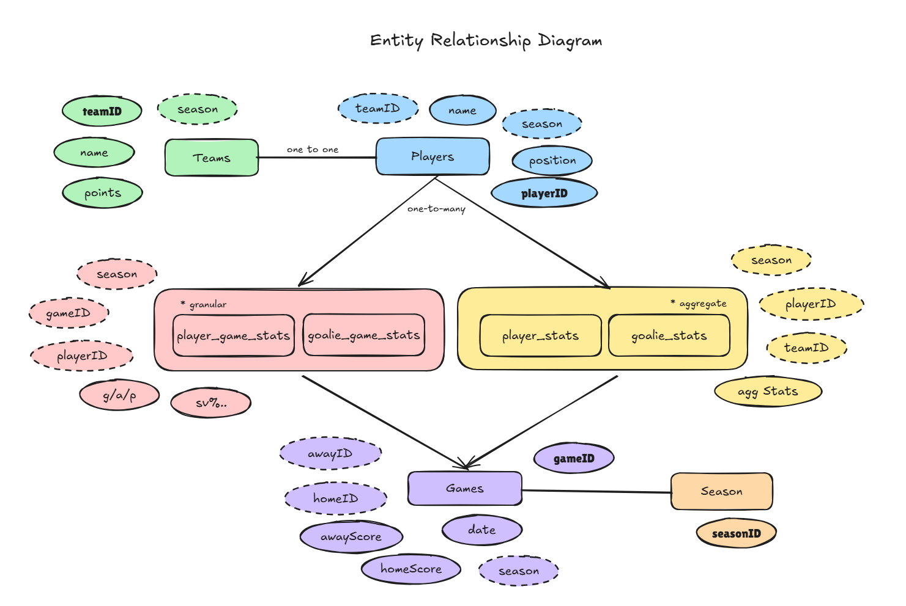

# [jdanalytics](https://jdanalytics.vercel.app/)

## Tech Stack
- **Frontend:** React + Vite
- **Backend:** FastAPI
- **Analytics and Data:** Python
- **Database:** Supabase (Postgres)

## Database Schema
High level schema of relational database in PostgreSQL.
Key Design Principles:
- Players and teams are stored once, with seasonal/game stats in separate tables
- Follow 3NF by to reduce data redundancy



## Setup

### Frontend
In /client directory, run the following commands:
```
npm install
npm run dev
```

### Backend
To set up backend, navigate to /server directory and run the following commands:

```
python3 -m venv venv
source venv/bin/activate
pip install -r requirements.txt
uvicorn api.main:app --reload
```

### Future Plans
Watch out for AI/ML features 👀
